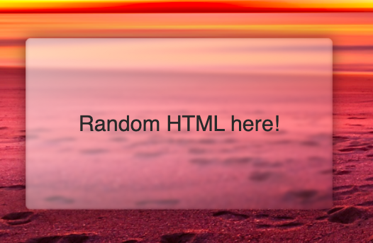
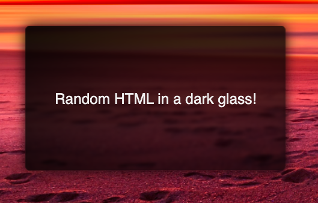

# GLASSIFY
glassify your HTML components!

# HOW TO USE:

1. To install the package using NPM use the following command <br/> ``npm install glassify``
2. To use the CSS from Glassify that was installed from NPM, import it directly in src/style.css or src/style.scss <br/>
```@import url('glassify/styles.scss');```


# NPM Link:
https://www.npmjs.com/package/glassify
  
# Simple Glass effect usage:

use css class `glassify` in css styles

```
<div class="glassify">
    Random HTML here!
</div>
```




# Dark Glass effect usage:

use css class `glassify-dark` to make the glass darker 

```
<div class="glassify glassify-dark">
  Random HTML in a dark glass!
</div>
```

